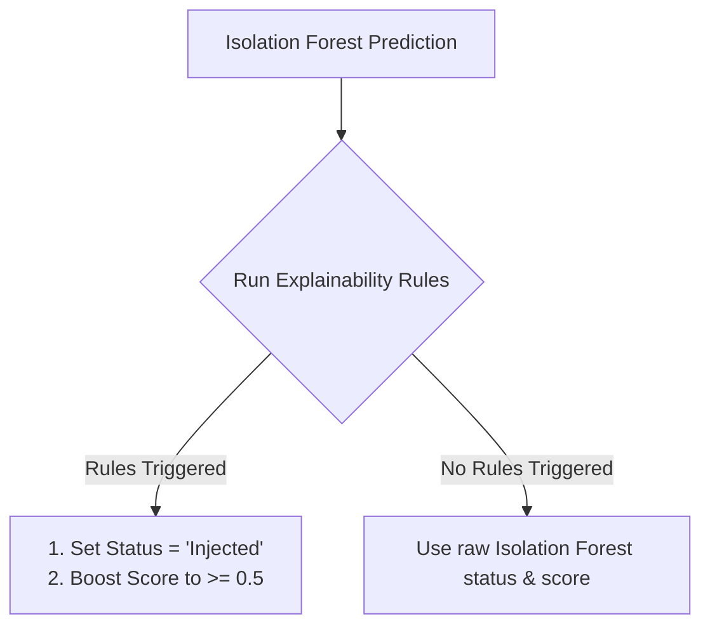

# Kavalar: Anomaly Detection Engine

This document details the mathematical formulations, feature extraction pipeline, machine learning model details, and rule-based fallback logic used by Kavalar to detect prompt injection behaviors.

---

## 📊 Feature Extraction Pipeline

When an agent session completes, the engine queries the `tool_calls` logs table and extracts a session feature map. The feature vector is mapped against a **dynamic vocabulary** built during the baseline training run.

### 1. Dynamic Vocabulary
The baseline vocab ($V$) represents the sorted list of all unique tools invoked during baseline profiling:
$$V = [t_1, t_2, \dots, t_M]$$
*For example, if the baseline only ran tasks involving `lookup_customer`, `read_document`, `search_documents`, and `calculator`, then $V = [\text{"calculator"}, \text{"lookup\_customer"}, \text{"read\_document"}, \text{"search\_documents"}]$. Note that $\text{"send\_email"}$ is excluded from $V$ since it is never invoked during safe baseline runs.*

### 2. Feature Vector Engineering
For any given session $S$, the behavior vector $\mathbf{x}$ is defined as a concatenated numerical array:

$$\mathbf{x} = [\mathbf{f}, c, t_{\text{avg}}, l_{\text{param}}, \mathbf{b}]$$

Where:
1.  **Tool Frequency Vector ($\mathbf{f}$)**: An $M$-dimensional vector representing the frequency counts of each vocabulary tool in the session:
    $$\mathbf{f} = [f_1, f_2, \dots, f_M] \quad \text{where } f_i = \text{count}(t_i \in S)$$
2.  **Execution Count ($c$)**: Total number of tool calls in the session:
    $$c = |S|$$
3.  **Average Execution Time ($t_{\text{avg}}$)**: The mean execution latency of all tools executed in the session:
    $$t_{\text{avg}} = \frac{1}{|S|} \sum_{tc \in S} \text{latency}(tc)$$
4.  **Parameter Payload Length ($l_{\text{param}}$)**: Sum of character lengths of all tool argument strings:
    $$l_{\text{param}} = \sum_{tc \in S} \text{len}(\text{JSON.stringify}(tc.\text{args}))$$
5.  **Transition Bigrams ($\mathbf{b}$)**: Flat occurrence count of transitions between tools in vocabulary.

This structured behavior vector is converted into a numpy array and reshaped:
```python
X = session_bv.to_array().reshape(1, -1)
```

---

## 🌲 Isolation Forest Machine Learning Model

The core classifier is an **Isolation Forest** model from `scikit-learn` trained on the baseline feature matrix.

### 1. How It Works
*   Isolation Forest isolates anomalies by randomly selecting a feature and then randomly selecting a split value between the maximum and minimum values of the selected feature.
*   Since anomalies deviate significantly from normal profiles, they require fewer random partitions to isolate, resulting in shorter path lengths in the trees of the forest.

### 2. Anomaly Scoring & Sigmoid Scaling
The raw decision score $d$ returned by scikit-learn is centered around 0.0 (where negative values represent anomalous samples and positive values represent normal samples).

To present this to users as an intuitive confidence score $P(\text{Injection}) \in [0.0, 1.0]$, the engine applies a **Sigmoid Scaling Function**:

$$Score = \frac{1}{1 + e^{-k \cdot d}}$$

In our implementation, we set the scaling coefficient $k = -10.0$ to invert the scale (so high probability indicates high anomaly):

$$Score = \frac{1}{1 + e^{d \cdot 10.0}}$$

*   If the raw decision score $d \le 0$ (anomalous), the scaled score resolves to $Score \ge 0.5$.
*   If the raw decision score $d > 0$ (normal), the scaled score resolves to $Score < 0.5$.

---

## 🕵️ Rule-Based Explainability & Override Layer

Machine learning models are prone to false negatives due to data drifts or minor vector alignments. Kavalar deploys a deterministic **Rule-Based Explanation Layer** (`BehaviorExplainer`) that runs concurrently with the Isolation Forest model. 

If any high-confidence rules are triggered, the engine **overrides** the Isolation Forest status to `"Injected"` and boosts the anomaly score into the `0.5 - 0.9` range:



### 🚨 Override Rules Checklist

1.  **Unexpected Tool Usage**:
    *   **Rule**: Checks if the session sequence contains any tools not present in the dynamic baseline vocabulary $V$:
        $$T_{\text{unusual}} = \{t \in S \mid t \notin V\}$$
    *   **Trigger**: If $T_{\text{unusual}} \ne \emptyset$ (e.g., executing `send_email`), flag the anomaly.
2.  **Unusual Sequence Transitions**:
    *   **Rule**: Extract all adjacent tool pairs (bigrams) in the session sequence and compare them with the set of all bigrams observed during baseline training ($B_{\text{baseline}}$).
    *   **Trigger**: If the session transition $(t_j \rightarrow t_{j+1}) \notin B_{\text{baseline}}$, flag an abnormal transition sequence (e.g., `search_documents -> send_email`).
3.  **Unusual Execution Count**:
    *   **Rule**: Compares total calls ($c$) against training run counts.
    *   **Trigger**: If $c > \text{max}(C_{\text{baseline}})$ or $c > (\mu_{c} + 2\sigma_{c})$, flag high-frequency looping or scraping behaviors.
4.  **Abnormal Parameter Lengths**:
    *   **Rule**: Compares total parameter characters ($l_{\text{param}}$) against training run lengths.
    *   **Trigger**: If $l_{\text{param}} > \text{max}(L_{\text{baseline}})$ or $l_{\text{param}} > (\mu_{l} + 2\sigma_{l})$, flag bloated payloads representing embedded system prompt overrides.
5.  **Suspicious Payload Regex Pattern Matching**:
    *   **Rule**: Inspects the raw prompt or tool argument content for injection vectors.
    *   **Trigger**: If matching regex patterns for SQL injection (`UNION SELECT`, `DROP TABLE`), path traversal (`../../`), shell execution (`/bin/bash`, `chmod`), or scripts (`<script>`), flag immediate security risk.
