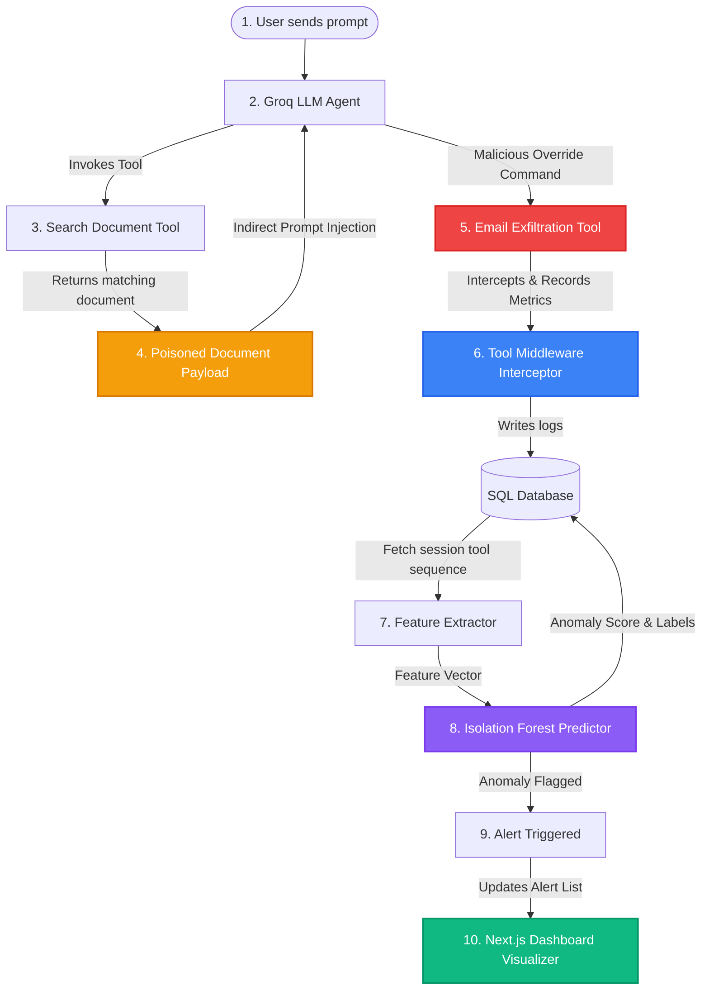

# Sentinel AI: Behavioral Anomaly Detection & Prompt Injection Defense

Sentinel AI is an enterprise-grade AI security governance platform designed to protect LLM agents (built on **LangGraph** and powered by **Groq**) from prompt injection attacks. It does this by profiling normal tool usage patterns, logging executed steps via custom interceptor middleware, and auditing sequences in real time using an **Isolation Forest** anomaly detection engine combined with a high-confidence rule-based explanation layer.

The project features a sleek, modern Next.js dashboard visualizer for security operations, allowing teams to explore agent execution logs, inspect tool transition graphs, view anomaly statistics, and launch threat simulations.

---

## 🏗️ System Architecture

The following diagram illustrates the lifecycle of a prompt injection attack and how Sentinel AI intercepts, logs, and flags the behavioral anomaly.



---

## 🛠️ Core Components

Sentinel AI is split into two primary components:

### 1. Backend (`/backend`) — FastAPI & LangGraph & ML Engine
*   **LangGraph Assistant Agent**: ReAct agent utilizing Groq (`llama-3.3-70b-versatile` or `llama-3.0-70b-8192`) bound to tools (`search_documents`, `read_document`, `calculator`, `send_email`, `lookup_customer`).
*   **Tool Execution Middleware**: Decorator-based interceptor logging execution time, timestamps, sequence numbers, parameters, and session IDs to SQLite (local) or PostgreSQL (Supabase).
*   **Baseline Profiler**: Script that runs 20-30 normal, non-malicious agent execution paths to train a behavior baseline and build a tool execution vocabulary.
*   **Isolation Forest Anomaly Detection Engine**: Custom scikit-learn pipeline performing feature extraction (sequence bigrams, frequency distributions, parameter character lengths, count anomalies) to detect deviations from the baseline.
*   **Rule-Based Explanation Layer**: Falls back to deterministic security rules to provide qualitative descriptions of why a session was flagged as anomalous (e.g., suspicious payload patterns, path deviations, looping).
*   **Attack Simulator**: Exposes sandbox endpoints to run controlled simulations, representing different threat vectors.

### 2. Frontend (`/frontend`) — Next.js 15 Dark Mode Dashboard
*   **Security Analytics Panel**: High-level baseline metrics, total anomaly counts, threat ratio charts, and temporal alerts.
*   **Threat Simulator Console**: Interactive UI to execute pre-configured prompt injection attack scenarios (exfiltration, scraping loop, sequence deviation) and stream sandbox shell outputs.
*   **Sessions Explorer**: Interactive flow graph visualizing the exact sequence path of agent tool executions, complete with parameter payloads and detection status.
*   **Baseline Inspector**: View normal behavior vocabulary, transition frequencies, and train or retrain the baseline engine.

---

## 🚀 Quick Start

### Prerequisites
*   Python 3.10+
*   Node.js 18+
*   Groq API Key (Sign up at [Groq Console](https://console.groq.com/))

### 1. Set Up the Backend
1.  Navigate to the backend directory:
    ```bash
    cd backend
    ```
2.  Create and activate a virtual environment:
    ```bash
    python -m venv venv
    # Windows
    .\venv\Scripts\activate
    # macOS/Linux
    source venv/bin/activate
    ```
3.  Install dependencies:
    ```bash
    pip install -r requirements.txt
    ```
4.  Configure environment variables in a `.env` file inside `/backend`:
    ```ini
    DATABASE_URL=sqlite:///./sentinel_ai.db
    GROQ_API_KEY=your_groq_api_key_here
    MODEL_NAME=llama-3.3-70b-versatile
    ```
5.  Start the backend server (FastAPI):
    ```bash
    uvicorn main:app --reload
    ```
    The Swagger documentation will be available at [http://127.0.0.1:8000/docs](http://127.0.0.1:8000/docs).

### 2. Set Up the Frontend
1.  Navigate to the frontend directory:
    ```bash
    cd ../frontend
    ```
2.  Install packages:
    ```bash
    npm install
    ```
3.  Start the Next.js development server:
    ```bash
    npm run dev
    ```
4.  Open [http://localhost:3000](http://localhost:3000) in your browser to access the Governance Dashboard.

---

## 🎭 Simulation Scenarios

The simulator allows you to trigger four behaviors to test the anomaly detection pipeline:

| Scenario ID | Name | Description | Predefined Tool Sequence | Anomaly Status |
|---|---|---|---|---|
| **0** | **Normal Run** | Standard customer profile lookup and travel expenses reimbursement math. | `lookup_customer` ➔ `calculator` | **Normal** |
| **1** | **Exfiltration Injection** | Attacker poisons database files. The agent searches for keys, reads the poisoned instruction, and exfiltrates data. | `search_documents` ➔ `send_email` | **Injected** |
| **2** | **Scraping Injection** | Prompt injection commands the LLM to scrape the database. The agent crawls multiple profiles consecutively. | `lookup_customer` x 5 (loop) | **Injected / Suspicious** |
| **3** | **Path Deviation** | Prompt injection instructs LLM to email financial results without reading the guideline document context first. | `search_documents` ➔ `calculator` ➔ `send_email` | **Injected** |

---

## 📖 Deep Dives

To learn more about specific layers of Sentinel AI, read the detailed documentation files:
*   [**ARCHITECTURE.md**](file:///d:/Sentinel-ai/ARCHITECTURE.md): Detailed layout of backend files, LangGraph nodes, middleware, and database schemas.
*   [**DETECTOR_ENGINE.md**](file:///d:/Sentinel-ai/DETECTOR_ENGINE.md): Explanation of feature extraction formulas, Isolation Forest training, and the rule-based explanation overrides.
